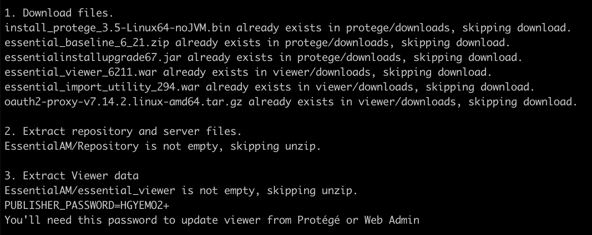
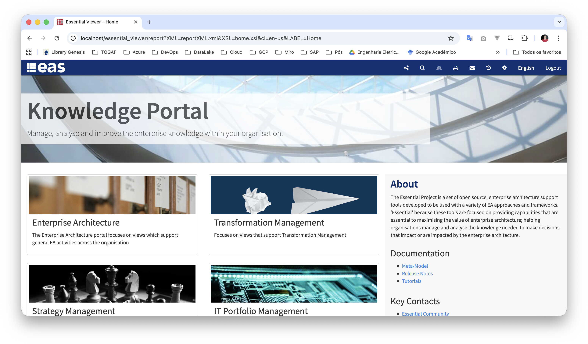
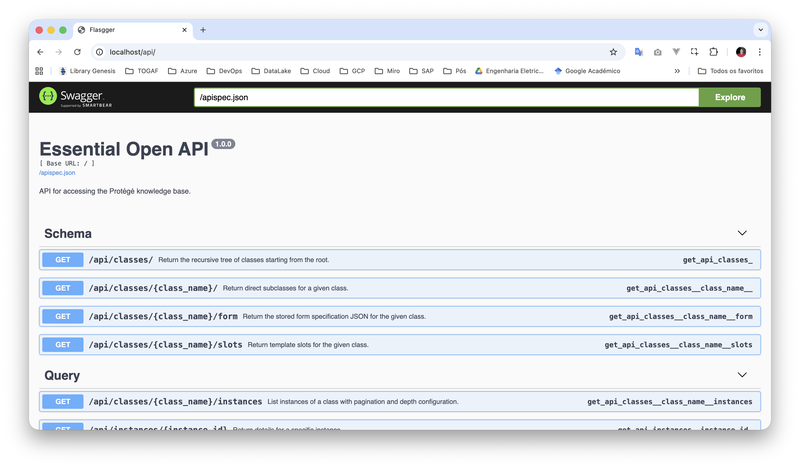
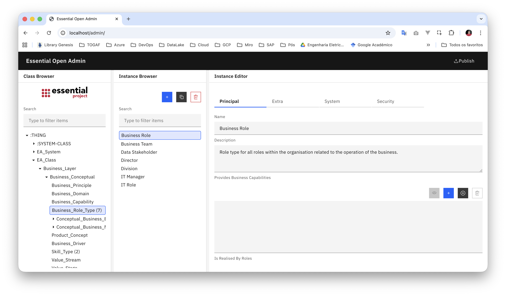
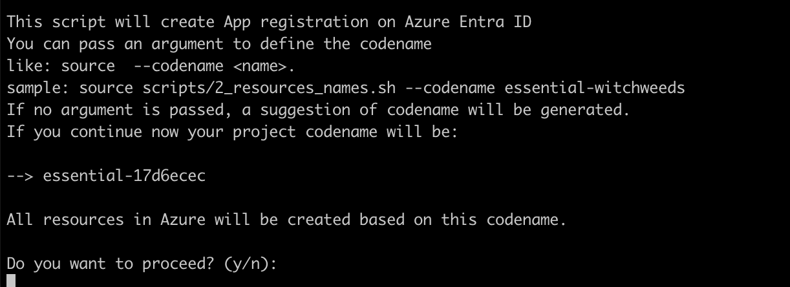
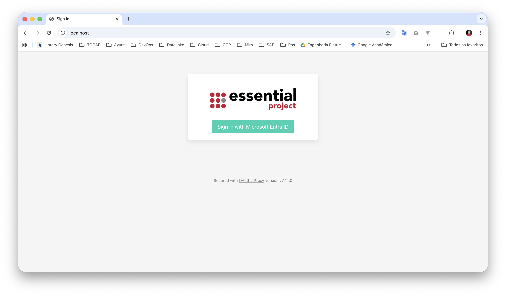

# EssentialOpen

This repository contains a set of scripts designed to run the open-source release of the Essential Project, uma API compatível com a do Essential Project e um painel de administração.

The scripts are built to containerize the application using Docker e o docker compose para que você rode a aplicação completa facilmente localmente

O repositório também tem scripts para um exemplo de configuração do Entra ID no Azure, possibilitando uma implementação completamente funcional, de autentifação integrada providing a secure and scalable environment for enterprise architecture management.

These scripts automate the setup, containerization, and congiguration of authentification with Oauth2-proxy, ensuring a smooth transition from local development to cloud deployment.

# Getting Started

To begin setting up the Essential Open Source EA Tool, follow these steps:

1.  Clone the repository:

    ```bash
    git clone git@github.com:terryvel/EssentialOpen.git
    ```

2.  Navigate to the project directory:

    ```bash
    cd EssentialOpen
    ```

3.  Prepare the environment for Docker image build:

    ```bash
    sh scripts/1_prepare.sh
    ```

    Here is an example of how the script should finish executing.



Save the password shown in the script, **PUBLISH_PASSWORD**. You will need it to publish changes to "Essential Viewer" using Protégé.

4. Now you can run the project locally with Docker:

```bash
docker compose -f docker-compose-noauth.yml up
```

You can access Essential Viewer at http://localhost.



You can access Essential Open API at http://localhost/api/.



You can access Essential Open Admin at http://localhost/admin/.



# Configure Azure Entra ID

This step-by-step guide configures authentication based on Entra ID, formerly Azure AD, so that only authenticated users can access Essential Viewer. This example is easily adjusted to use a corporate AD.

## Set resources names

To define the resource names, run the `2_resources_names.sh` script.
It must be run with the source command, as it will create some environment variables that will be used in the next scripts.

```bash
sh scripts/2_configure_entra_id.sh
```

Here is an example of how the script should finish executing.



## Run container locally with auth

```bash
docker compose up
```

You can access Essential Viewer with auth at http://localhost.



# That's it

I hope these steps help as many people as possible to test Essential, a great tool, and that these tests help you convince your board to invest in an EA tool (preferably Essential).

I would like to express my sincere gratitude to **Urbiwanus** for his work on the [essential-project-docker](https://github.com/Urbiwanus/essential-project-docker) repository. His project served as a significant reference and inspiration for me to get started with this setup. Without his contributions, this journey would have been much more challenging. Thank you, Urbiwanus!
